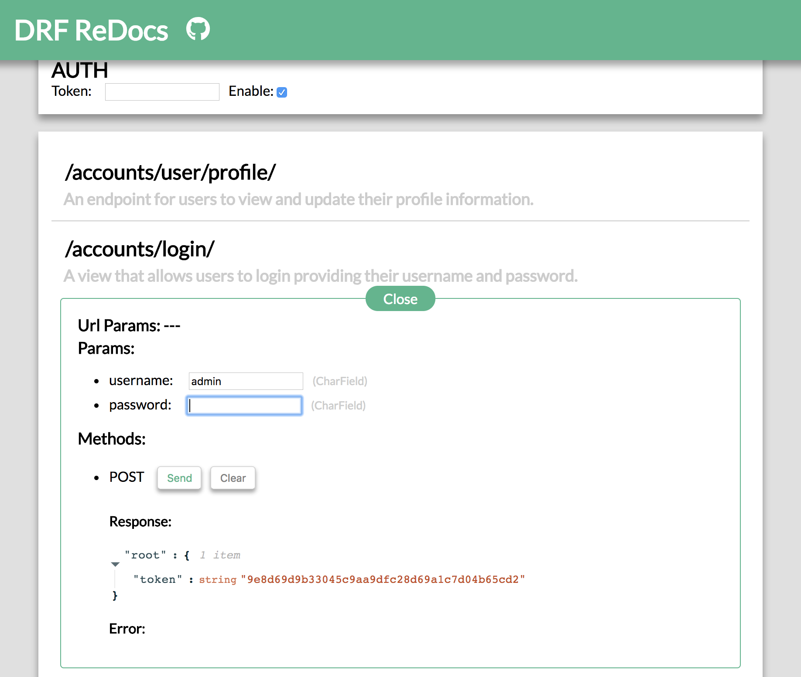

# Django REST Framework ReDocs

Automatically enable live API site for DRF, support both Django **1.x** and **2.x**!!

Inspired by [django-rest-framework-docs](https://github.com/manosim/django-rest-framework-docs) and [drf-autodocs](https://github.com/iMakedonsky/drf-autodocs), thanks for their great work.

## TODOs

* port Django 2.0.5 examples
* goes to pip

## Screenshot

    

