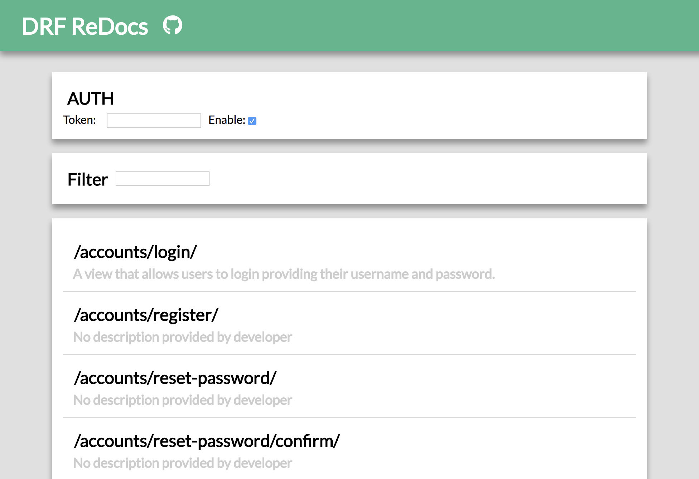
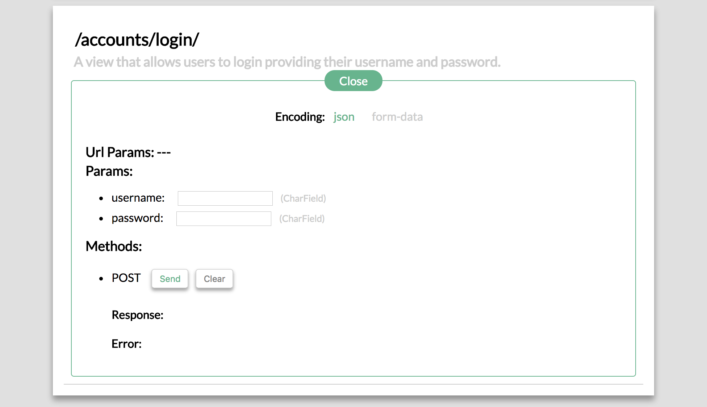

# Django REST Framework ReDocs

Automatically enable live API page for DRF, support both Django **1.x** and **2.x**!!

Inspired by [django-rest-framework-docs](https://github.com/manosim/django-rest-framework-docs) and [drf-autodocs](https://github.com/iMakedonsky/drf-autodocs), thanks for their great work!

## Features

* Support Django 1.8+ ~ 2.x, yah! 
* Automatic API endpoints detection
* Automatic API page generation
* Support applicatioin/json or multipart/form-data encoding
* Support FileField, so you can test file upload
* Support token auth
* API filtering 

## Installation

For now, please do `pip install git+https://github.com/whitedogg13/django-rest-framework-redocs`.

(We will publish it soon after some more tests!)

## Dependencies

For backend, this project only depends on `django` and `django-rest-framework`.

For frontend:

* It's a `React` SPA, and also uses several UMD builds served by `unpkg`
* It uses `babel-standalone` to transform the embedded JS code on-the-fly, so if you want to modify something you can just edit the code in `redocs/templates/index.html` without any prior setup and it should just work!

## Screenshot

    

    

## Feature request

Just open an issue to let us know your idea!

## Contributions

Contributions are welcome! We need your help to make this project better!

## Special Thanks

The automatic endpoint detection algorithm is adapted from [django-rest-framework-docs](https://github.com/manosim/django-rest-framework-docs) and [drf-autodocs](https://github.com/iMakedonsky/drf-autodocs)

